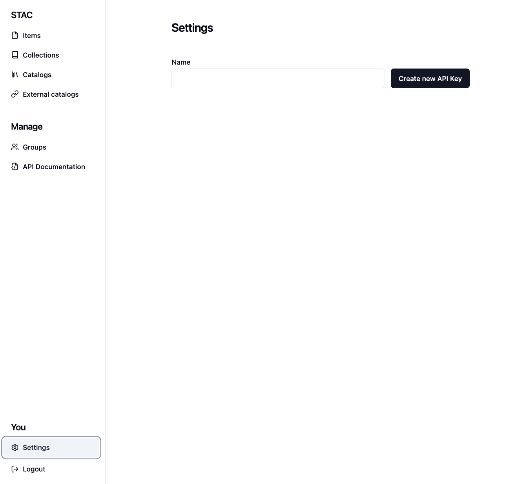

# Example on how to use the library

## Usage

Here we show a simple example on how to use the library.

### Create an API key

The API key can be created in the [Data Management Suite](https://datasuite.deltares.nl/app/settings) under the user settings.


### Create a client

First we import the library and define the necessary variables to create a client.

```python
from deltares_datasuite import DataManagementSuiteClient
# Define the necessary variables
dms_url = "https://datasuite.deltares.nl"
api_key = "example_api_key"

client = DataManagementSuiteClient(dms_url, api_key)
```

### Make a STAC item

When creating a new Item, instantiate a [DataManagementSuiteItem](../classes/item/#deltares_datasuite.DataManagementSuiteItem) object without the `id` property. The `id` property will be generated by the Data Management Suite.

The `collection_id` can be found

```python
from datetime import datetime, timezone
from geojson import Polygon

from deltares_datasuite import DataManagementSuiteItem
item_name = "Fair data - numerical models item"
item_description = """
    This project was a very complex model of the Dutch water system. After running the model the metadata is automatically uploaded to the Data Management Suite.
    The model was run for the years 2015-2019 and the results are stored in the Data Management Suite.
    A
    """
project_number = "11209789"
data_location = "P://11209789/Results/"
license = "MIT"

other_properties = { "DataSize": "1.5Tb"}

geometry = Polygon(
    coordinates=[
        [
            [5.119014591, 52.378756326],
            [5.026268967, 52.340002388],
            [5.092980732, 52.342487635],
            [5.12796373, 52.328071261],
            [5.144234892, 52.332048661],
            [5.129590846, 52.339008251],
            [5.128777288, 52.365345348],
            [5.119014591, 52.378756326],
        ]
    ],
)

# Find the collection ID of the collection you want to add the item to in the URL when editing the Collection in the DMS
collectionId = ""

# Create a DMSItem object
dms_item = DataManagementSuiteItem(
    title=item_name,
    projectNumber=project_number,
    description=item_description,
    location=data_location,
    license=license,
    collection=collectionId,
    geometry=geometryes=other_properties,
    datetime=datetime.now(tz=timezone.utc),
)
```

### Upload the item

```python
# Submit the DMSItem object
updated_item = client.create_or_update_item(dms_item)

print(updated_item.id)
```
